# A3 – Parametric Design and FEA

## Objective

The goal of this assignment was to design an aluminum bar based on a maximum allowed deflection and then verify the design using FEA. I used a 400 lbf tensile load and designed the bar so that its maximum axial deflection would be about 0.009 in. I then modeled the bar parametrically in SolidWorks and compared the hand calculations with the simulation results.

---

## Analyze

### Design Setup

I chose a circular bar with a 0.50 in diameter and a 400 lbf axial tensile load. I used 6061-T6 aluminum and an elastic modulus of about 10 million psi for the hand calculations. The bar was fixed at one end and pulled from the opposite end.

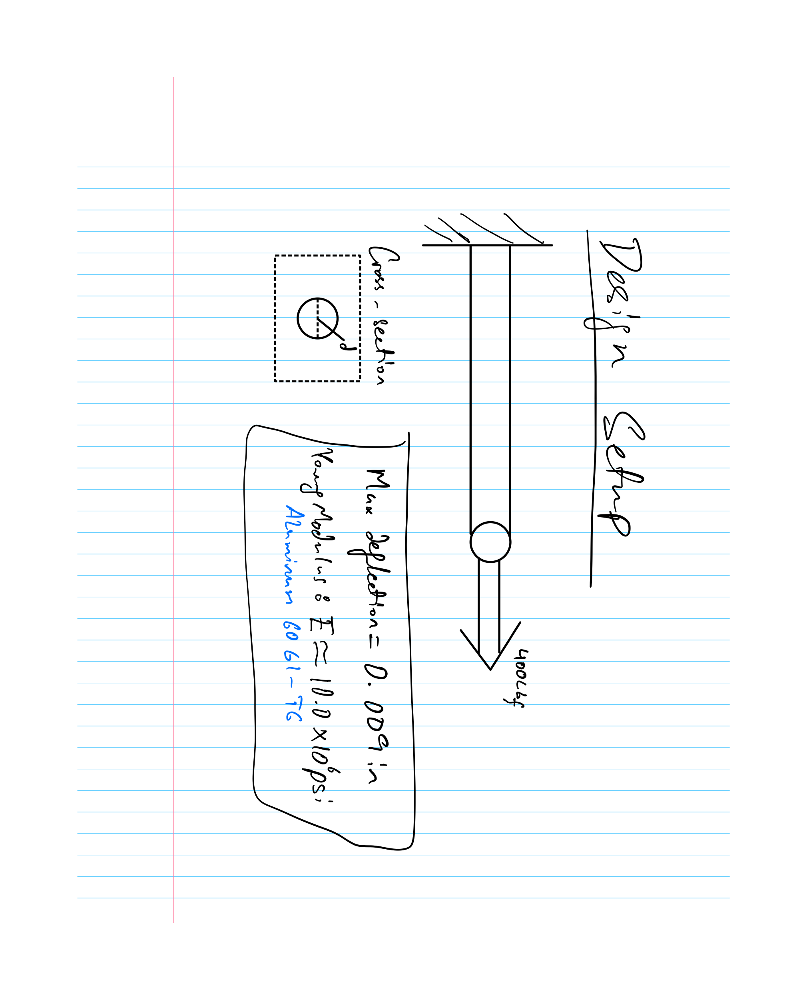

### Parametric Length Calculation

I used the axial deflection equation from the Machinery's Handbook and solved it for the required bar length. The calculated cross-sectional area was 0.1963 in² and the resulting bar length was approximately 44.18 in.

The complete calculation is shown below.

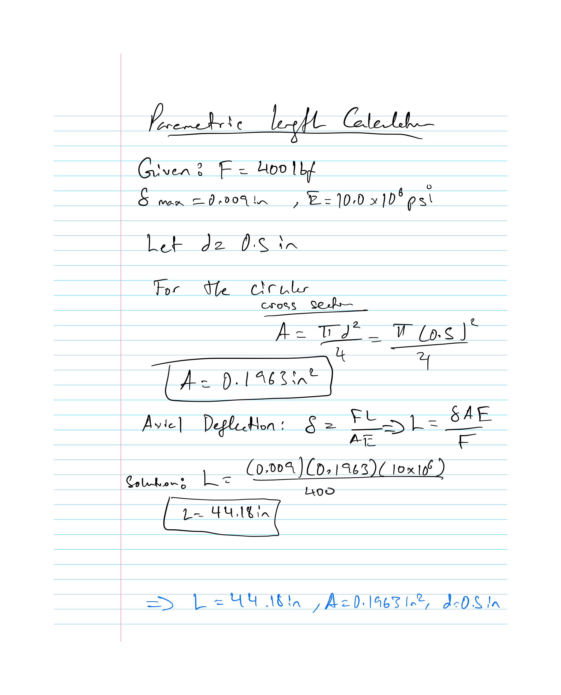

### SolidWorks Model

I started the SolidWorks model by creating the 0.50 in diameter circular cross section.

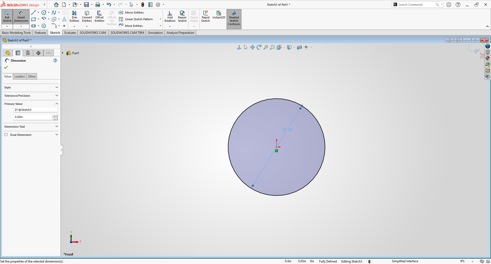

I then created global variables for the force, maximum deflection, elastic modulus, diameter, area and bar length. The area and length were calculated using relationships instead of being entered as fixed values.

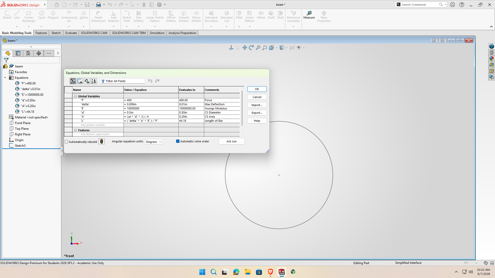

The extrusion length was linked to the calculated length variable. This allowed SolidWorks to automatically change the bar length when one of the design parameters changed.

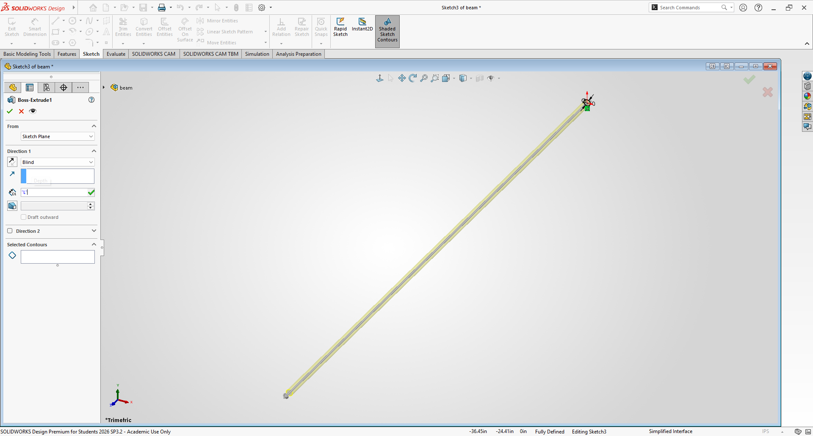

The completed bar had a diameter of 0.50 in and a length of about 44.18 in.

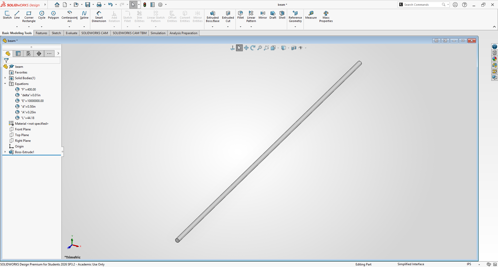

### Material

I assigned 6061-T6 aluminum to the bar. The SolidWorks material library gave an elastic modulus very close to the value I used in my hand calculation.

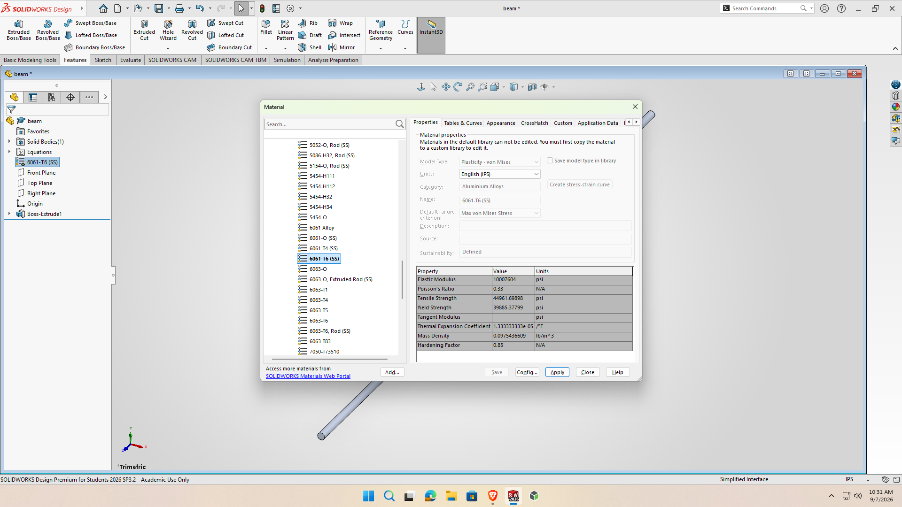

### FEA Setup

For the FEA, I fixed one circular end of the bar.

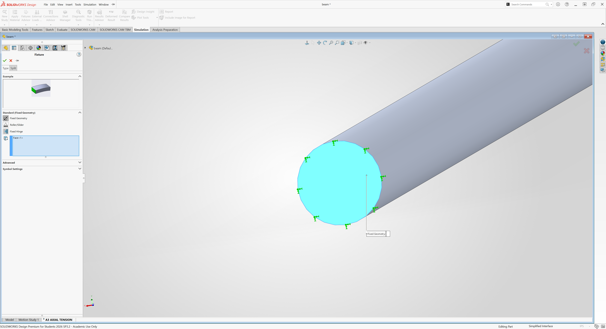

I then applied the same 400 lbf tensile load to the opposite end.

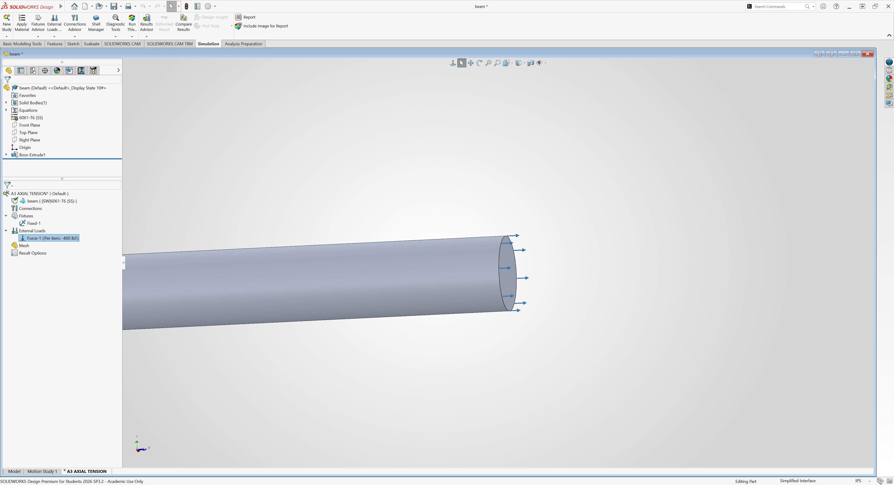

### Deflection Results

The maximum deflection from SolidWorks was 0.009004 in.

This was extremely close to the 0.009 in value used in the hand calculation.

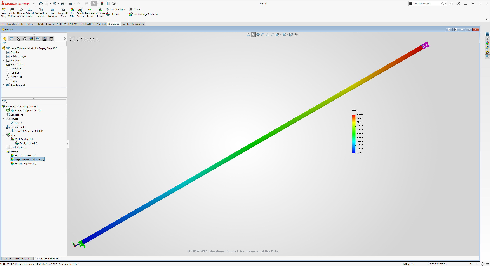

### Stress Results

The maximum von Mises stress from the FEA was 2.038 ksi.

The assignment gives a yield strength of 40 ksi, which resulted in a safety factor of approximately 19.63. This means the bar was well below the material yield strength.

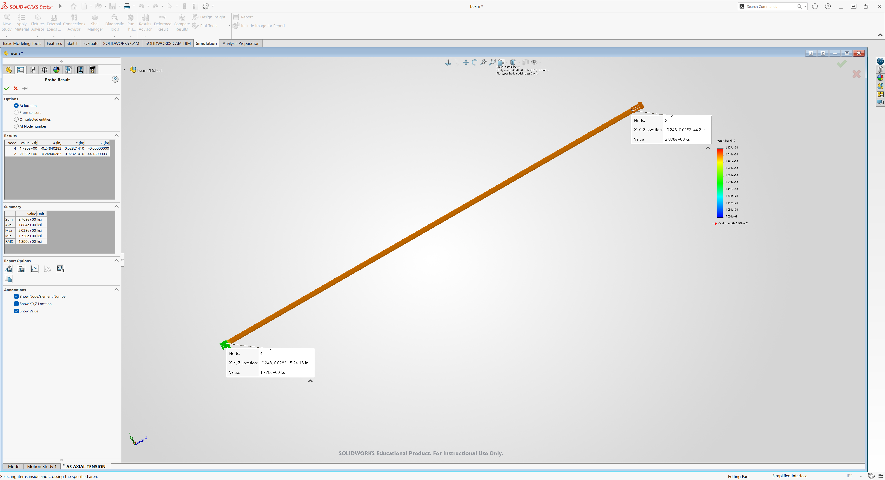

My FEA results and safety factor calculation are shown below.

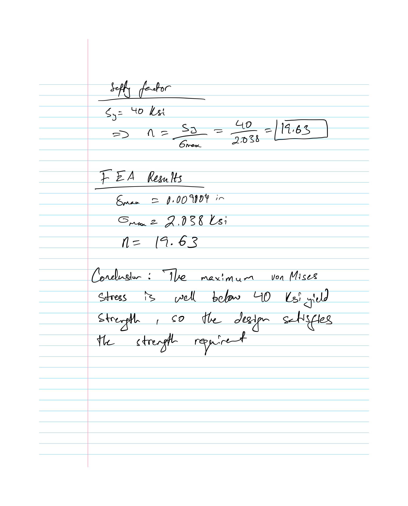

### Hand Calculation vs. FEA

The hand calculation predicted a deflection of 0.009 in while the SolidWorks result was 0.009004 in. The percent difference was approximately 0.044%.

The results were almost identical because the bar has a simple uniform cross section and is loaded directly in tension. The small difference could also be caused by the slightly different elastic modulus used by SolidWorks.

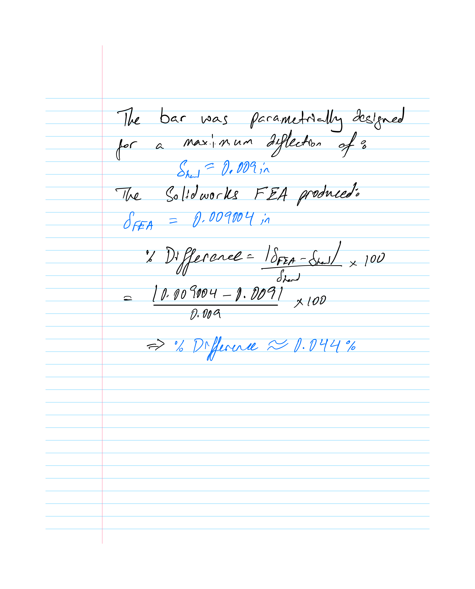

### Stress Concentration from a Hole

I also investigated what would happen if a fairly large hole was added to the bar. I used a stress concentration factor of 2.347 for the selected hole geometry.

The estimated local stress increased from 2.038 ksi to approximately 4.78 ksi. The safety factor dropped from 19.63 to approximately 8.37.

Even with the stress concentration, the estimated stress remained below the 40 ksi yield strength.

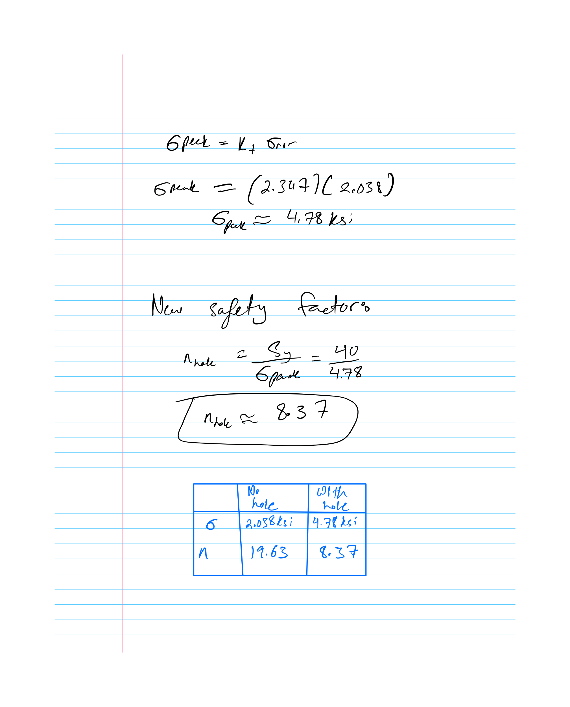

### MEGR 2157 – Parameter Change

For the MEGR 2157 portion, I changed some of the design parameters in the SolidWorks equation table and predicted what would happen to the bar length.

I changed the load from 400 lbf to 800 lbf and changed the diameter from 0.50 in to 0.30 in. I originally expected the bar to become longer, but SolidWorks calculated a new length of only about 7.95 in.

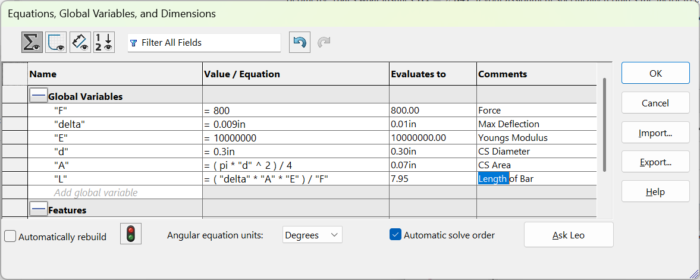

This helped me understand the relationship between the parameters better. Increasing the load required a shorter bar to maintain the same maximum deflection. Reducing the diameter also reduced the cross-sectional area, which made the allowable length even shorter.

---

## Decide

### Design Choices

I selected a 0.50 in circular cross section because it was simple to model and made it easy to see how changing the diameter affected the cross-sectional area and bar length.

I selected 400 lbf because it was within the required load range and gave me a reasonable design case to use for both the hand calculations and FEA.

I selected 6061-T6 aluminum because it satisfied the aluminum material requirement and was available directly in the SolidWorks material library.

### Parametric Design

Instead of manually entering the calculated 44.18 in length, I connected the extrusion length to the SolidWorks equations. This made the CAD model respond automatically when the design parameters changed.

---

## Communicate

### Lessons Learned

The biggest thing I learned from this assignment was the difference between strength and stiffness. The stress in the bar was far below the material yield strength, but the maximum allowable deflection still controlled the length of the design.

I also learned how useful parametric CAD can be. By connecting the engineering calculations directly to the SolidWorks model, changing a design value automatically changed the geometry.

The FEA also helped confirm that the hand calculation was accurate. The hand and FEA deflection values were almost identical.

### Mistakes

One mistake I made was predicting that the bar would become longer after changing the load and diameter. Instead, the calculated length became much shorter. Looking back at the relationship between load, cross-sectional area and deflection helped me understand why.

I also noticed that the SolidWorks material library used a slightly different elastic modulus than the value I used in my original calculation. This helped explain why the FEA and hand results were extremely close but not perfectly identical.

### Time Spent

Total time from start to finish:

**6 hours**

### CAD File

[Download A3 SolidWorks CAD File][a3_beam.zip](https://github.com/user-attachments/files/31979967/a3_beam.zip)

### References

- Machinery's Handbook, 31st Edition, Deflections section.
- SolidWorks material library for 6061-T6 aluminum.
- Stress concentration calculator used for the hole analysis. [Link Here](https://www.quadco.engineering/en/know-how/stress-concentration-factor-calculator.htm)
