# A4 – Motor Mount

## Objective

The objective of this assignment was to design an ABS motor mount for the provided 24 V DC gear motor.

The mount was designed for the required 300 N load, a safety factor of 3 and a maximum allowable deflection of 0.30 mm.

The design was divided into two main structural features:

- **Feature 1:** Motor-side feature
- **Feature 2:** Wall-side feature

The calculations were completed by hand using beam bending and deflection methods. The results were then used to create the final CAD model and engineering drawing.

---

## Analyze

### Design Setup and Material Selection

ABS was selected as the material for the motor mount.

Conservative ABS material properties were used so that the strength and stiffness of the material would not be overestimated.

The selected design information, material properties, applied load, safety factor and allowable deflection are shown in the handwritten notes below.

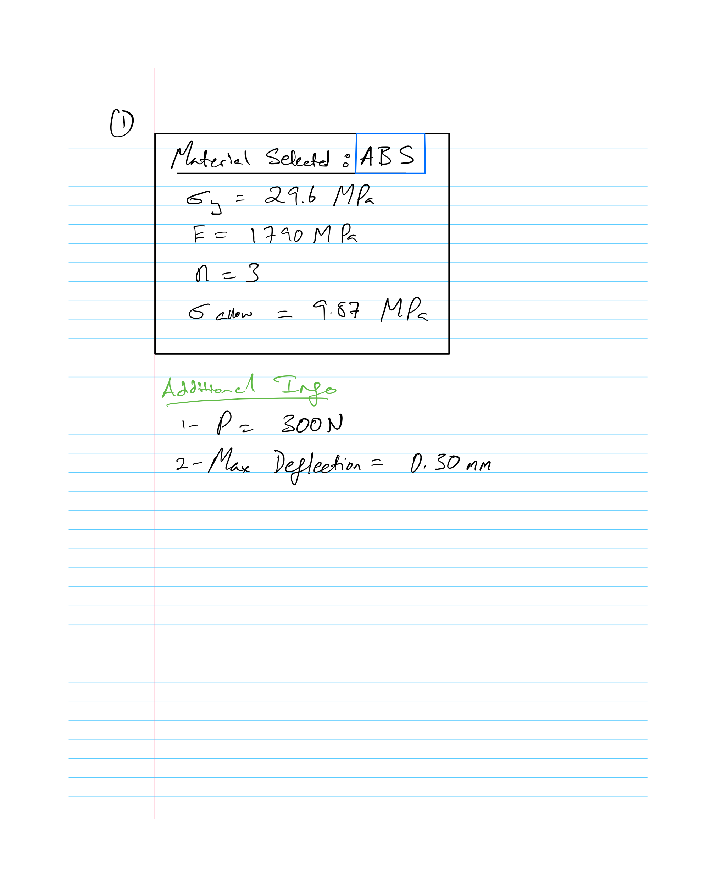

### Motor Dimensions

Appendix A was reviewed to determine the important motor dimensions needed for the design.

The motor drawing was used to identify the gearbox diameter, motor body diameter, shaft size, motor length and mounting geometry.

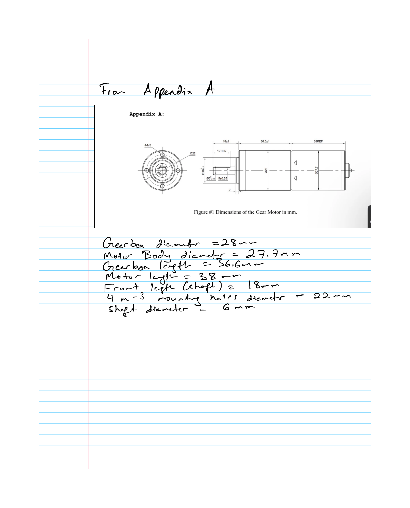

### Material Reference

[SpecialChem – Acrylonitrile Butadiene Styrene (ABS)](https://www.specialchem.com/plastics/guide/acrylonitrile-butadiene-styrene-abs-plastic)

---

### Feature 1 – Motor-Side Beam

Feature 1 supports the motor and was approximated as a cantilever beam.

The required thickness was determined by checking both bending stress and maximum deflection.

#### Knowns and Unknowns

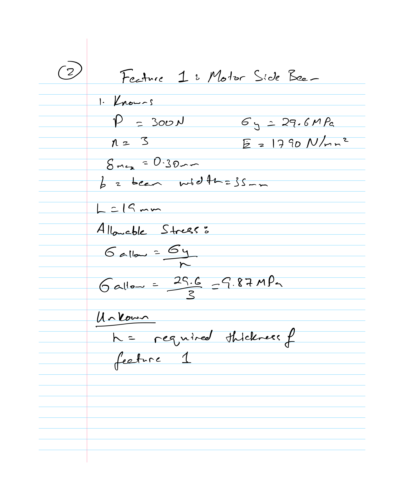

#### Free-Body Diagram and Stress Analysis

The free-body diagram and symbolic stress analysis are shown below.

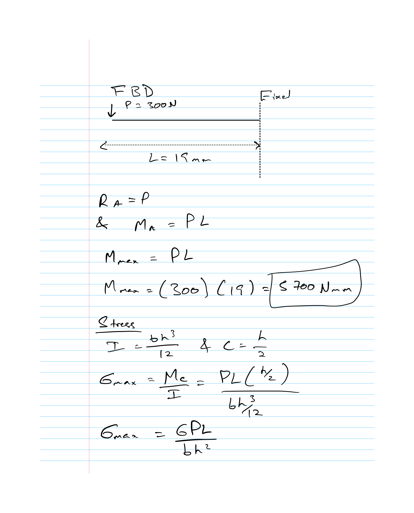

The stress equation was solved symbolically for the required Feature 1 thickness.

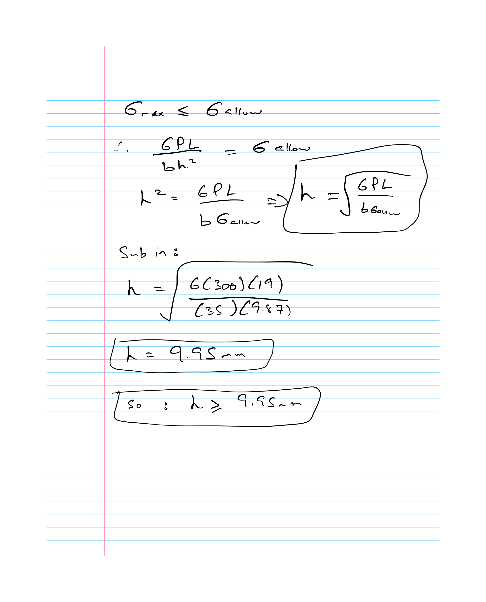

#### Deflection Analysis

The deflection requirement was analyzed separately using the cantilever beam model.

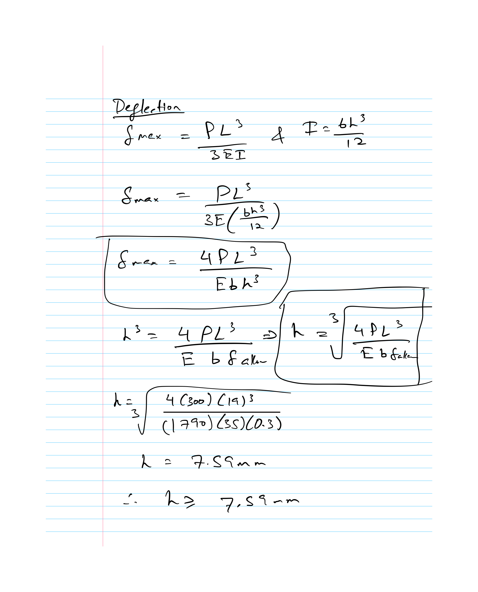

#### Feature 1 Final Selection

The required thickness from the stress analysis was greater than the thickness required from the deflection analysis.

Therefore, stress controlled the Feature 1 design.

A final practical thickness of **10 mm** was selected.

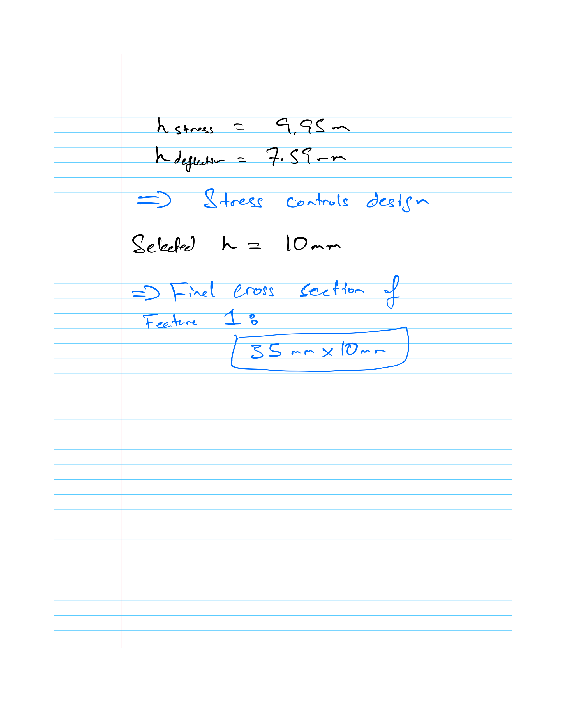

---

### Feature 2 – Wall-Side Beam

Feature 2 attaches the motor mount to the rigid wall and transfers the load from Feature 1 into the wall.

Feature 2 was also analyzed for both bending stress and deflection.

## Knowns and Unknowns

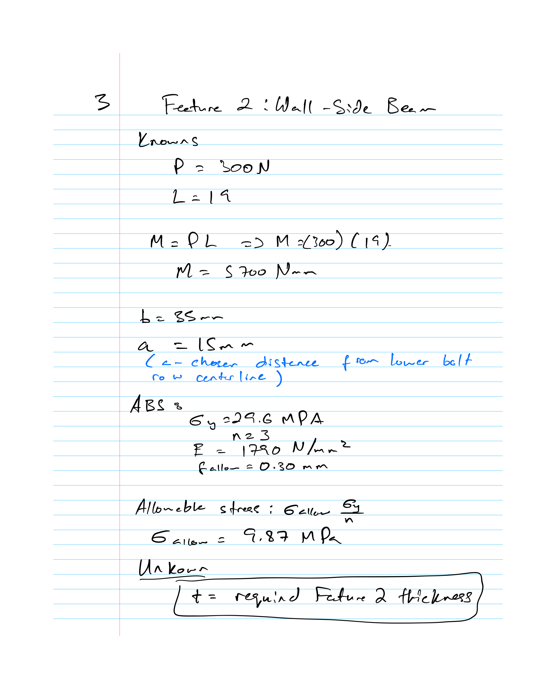

#### Free-Body Diagram and Stress Analysis

The transferred moment and simplified Feature 2 beam model were used for the stress analysis.

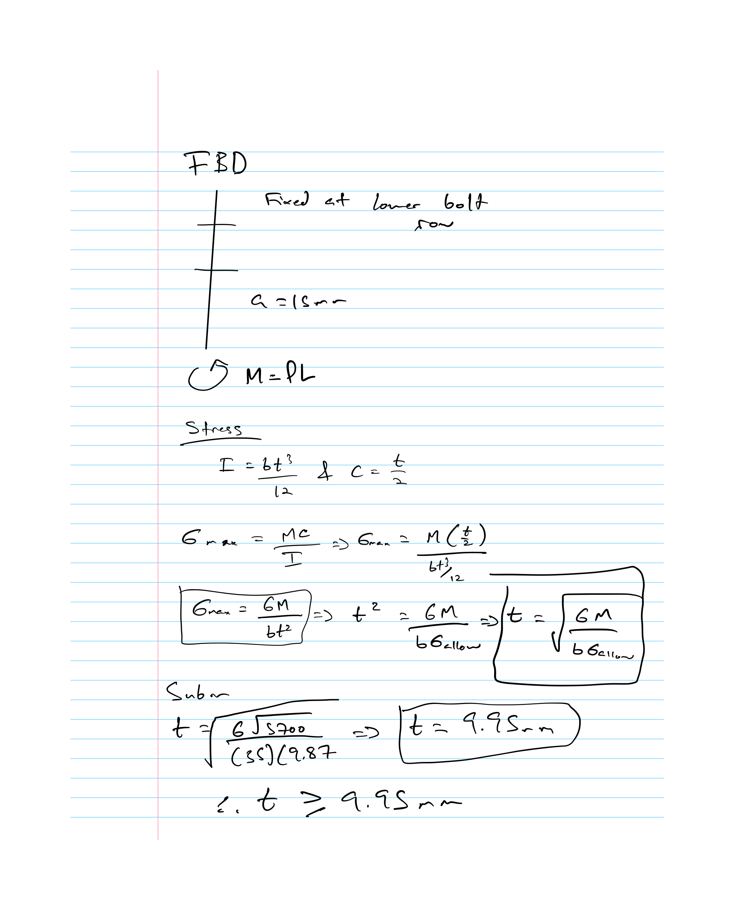

#### Deflection Analysis

Feature 2 was also checked against the maximum allowable deflection.

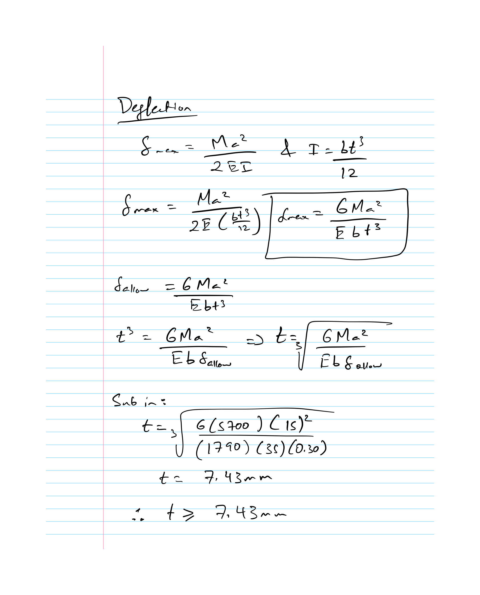

#### Feature 2 Final Selection

The stress requirement again controlled the design.

A final practical thickness of **10 mm** was selected for Feature 2.

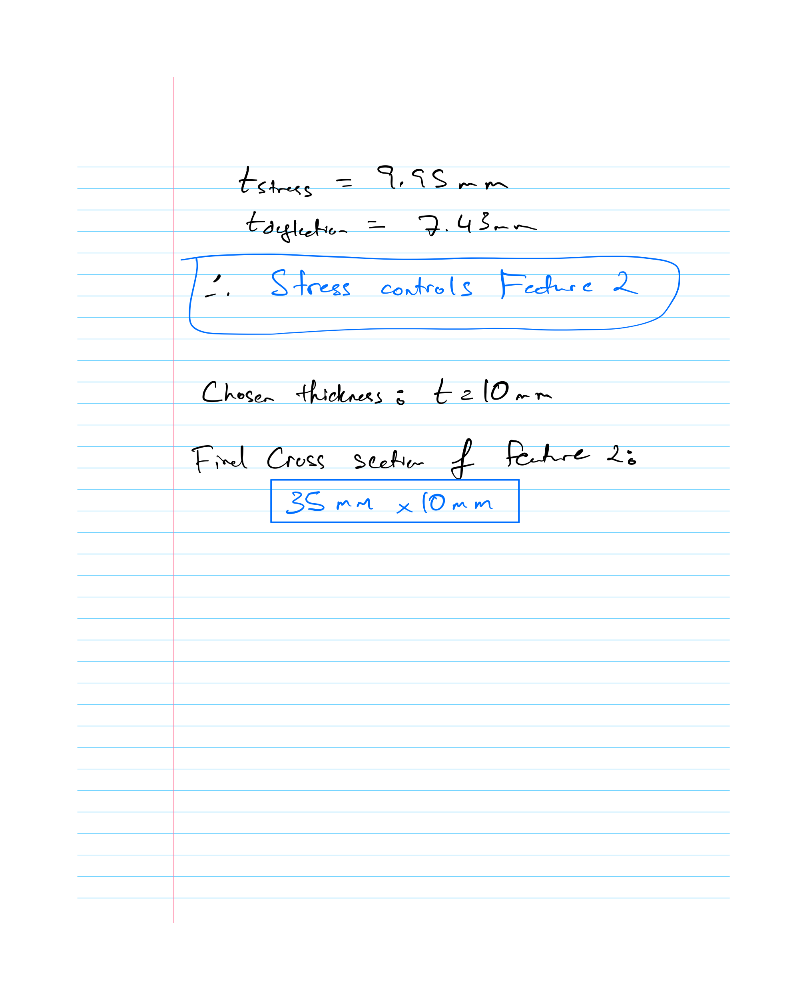

---
## Decide

### Final Design Sketch

The results from the Feature 1 and Feature 2 calculations were combined into the final motor mount concept.

A simple L-shaped bracket was selected to keep the design easy to model and manufacture.

The final sketch includes the main dimensions, wall mounting holes, motor clearance feature and shaft opening.

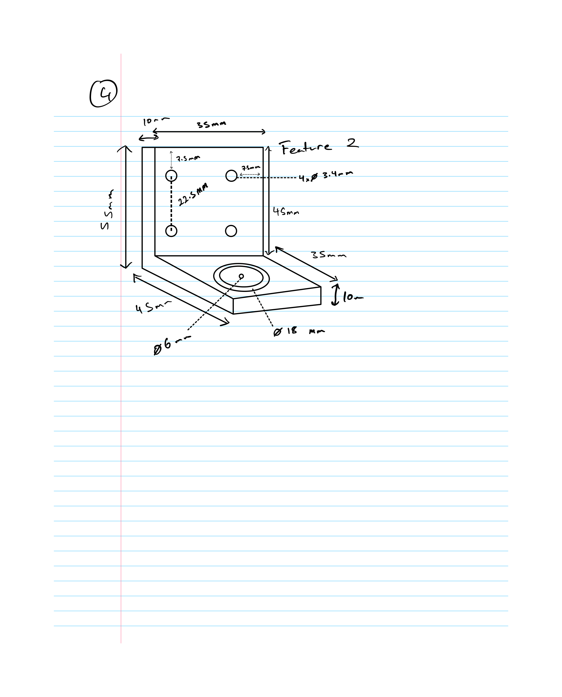

---

### Parametric CAD Model

The motor mount was modeled in SolidWorks using the dimensions selected from the hand calculations and design sketch.

Parametric modeling was used so that important dimensions could be modified easily.

#### Global Variables

Global variables were created for the major mount dimensions and hole locations.

#### Feature 1 Construction

Feature 1 was created using the dimensions selected from the hand calculations.

#### Feature 2 and Wall Mounting Holes

Feature 2 was modeled with four clearance holes for attachment to the rigid wall.

The hole locations were fully defined in the sketch.

#### Motor Clearance Feature

A stepped circular feature was created on Feature 1 for the front portion of the motor and shaft.

#### Final CAD Model

The completed model combines both structural features into one simple L-shaped ABS motor mount.

---

### Design Choices

I selected a simple L-shaped bracket because it provided a direct way to support the motor while transferring the load into the wall.

A 10 mm thickness was selected for both Feature 1 and Feature 2 based on the hand calculations and then rounded to a practical design value.

The overall dimensions were kept compact so the mount would remain simple and easy to manufacture. Four wall mounting holes were used to provide a stable connection to the rigid wall.

The motor-side opening was designed with a larger recessed feature for the front motor geometry and a smaller central opening for the motor shaft.

I also kept the design free of unnecessary features such as gussets because the selected dimensions already satisfied the required stress and deflection limits.

## Communicate

### Engineering Drawing

A multiview engineering drawing was created from the finished CAD model.

The drawing includes the required orthographic views, isometric view, important dimensions, hole locations, material information, scale and title block.

[Download Engineering Drawing](files/A4_DRAWING.pdf)

---

### Design Process

The design began by reviewing the assignment requirements, motor dimensions, ABS material properties and several existing motor mount designs.

The mount was simplified into two beam-like features so that the required dimensions could be determined using hand calculations.

After the analytical design was completed, the dimensions were transferred into SolidWorks. Global variables were used to keep the model parametric and make the major dimensions easy to update.

The final design was intentionally kept simple rather than adding unnecessary geometry.

### Mistakes and Design Changes

One mistake made early in the process was initially interpreting the 22 mm dimension in Appendix A as the motor diameter. After reviewing the drawing more carefully, it was identified as part of the motor mounting geometry, while the actual motor and gearbox diameters were shown separately.

The motor opening was also refined during the CAD process. A stepped opening was used to provide clearance for the motor front geometry while maintaining a smaller through hole for the shaft.

Gussets were considered as a possible way to increase stiffness but they were not added because the selected plate thickness already satisfied the hand calculations and the goal was to keep the design simple.

---

### Lessons Learned

This assignment helped connect beam calculations directly to a physical CAD design.

The main lessons learned were:

- How to simplify a real component into beam models for analysis
- How stress and deflection can produce different required dimensions
- How to determine which design requirement controls the final geometry
- The importance of carefully reading manufacturer drawings
- How to make reasonable engineering assumptions
- How to use hand calculations to determine CAD dimensions
- How parametric modeling makes a design easier to modify
- How an engineering drawing communicates the final design for manufacturing

### Time Spent

**Total Time:** 7 Hours

---

### Files

[Download Motor Mount CAD Files][A4.zip](https://github.com/user-attachments/files/32308227/A4.zip)

[Download Engineering Drawing][A4 DRAWING.pdf](https://github.com/user-attachments/files/32308296/A4.DRAWING.pdf)

---

## Appendix – Design Research

Several motor mount designs were reviewed before developing the final concept.

Common features included:

- L-shaped mounting brackets
- Motor and shaft clearance openings
- Bolt mounting patterns
- Reinforced corners
- Simple manufacturable geometry

These references helped guide the initial design concept while the final dimensions were determined from the hand calculations.

## References

- [SpecialChem – ABS Material Properties](https://www.specialchem.com/plastics/guide/acrylonitrile-butadiene-styrene-abs-plastic)
- [GrabCAD – Universal DC Motor Mounting Holder](https://grabcad.com/library/universal-dc-motor-mounting-holder-1)
- [Gimson Robotics – Gearbox Motor Mounting Bracket](https://gimsonrobotics.co.uk/products/stainless-steel-motor-mounting-bracket-for-45mm-gearboxes)
- [AM Robotics – Planetary Gearbox Motor Bracket](https://www.amrobotics.in/products/3mm-thick-ms-motor-mounting-bracket-clamp-for-nema17-planetary-gearbox-motors-model-2-matt-black)
