# A6 – Design for Strength and Stiffness II

## Objective

The objective of this assignment was to continue the bracket design from A5 by creating a parametric CAD model based on the previous strength analysis and producing a fully dimensioned engineering drawing. The model was also updated to accommodate the revised T-beam geometry.

---

## Analyze

The bracket dimensions were based on the strength-controlled dimensions determined during A5. Global variables and equations were used in SolidWorks so that important dimensions could be controlled parametrically.

Feature A was directly controlled by the strength analysis through the SolidWorks equation table. Instead of manually entering its diameter, the analytical relationship was entered into SolidWorks so the diameter would automatically update if the load, allowable stress or Feature A length changed.

### Parametric Equation Table

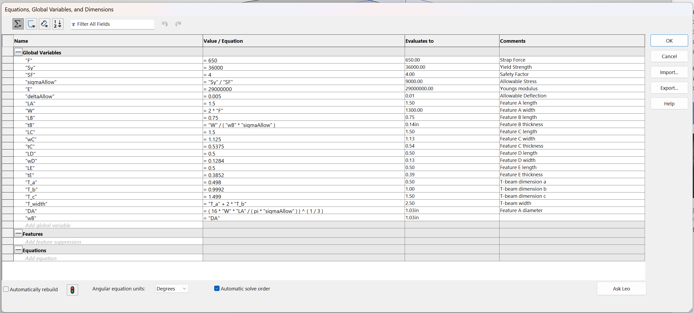

---

## Decide

### Feature A

Feature A was modeled first using the calculated diameter and required length.

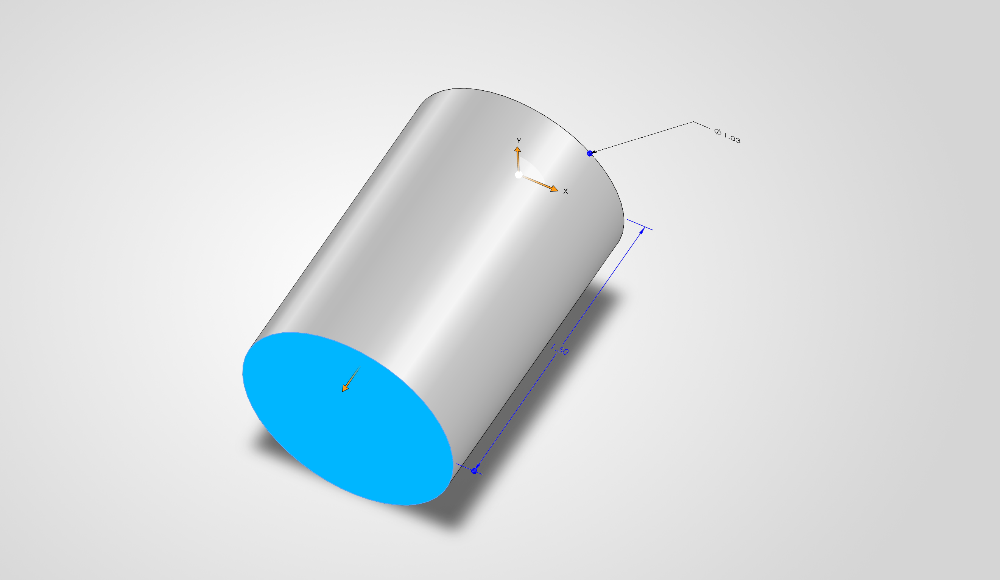

### Feature B

Feature B was attached to Feature A and its thickness was controlled using the parameters established in the equation table.

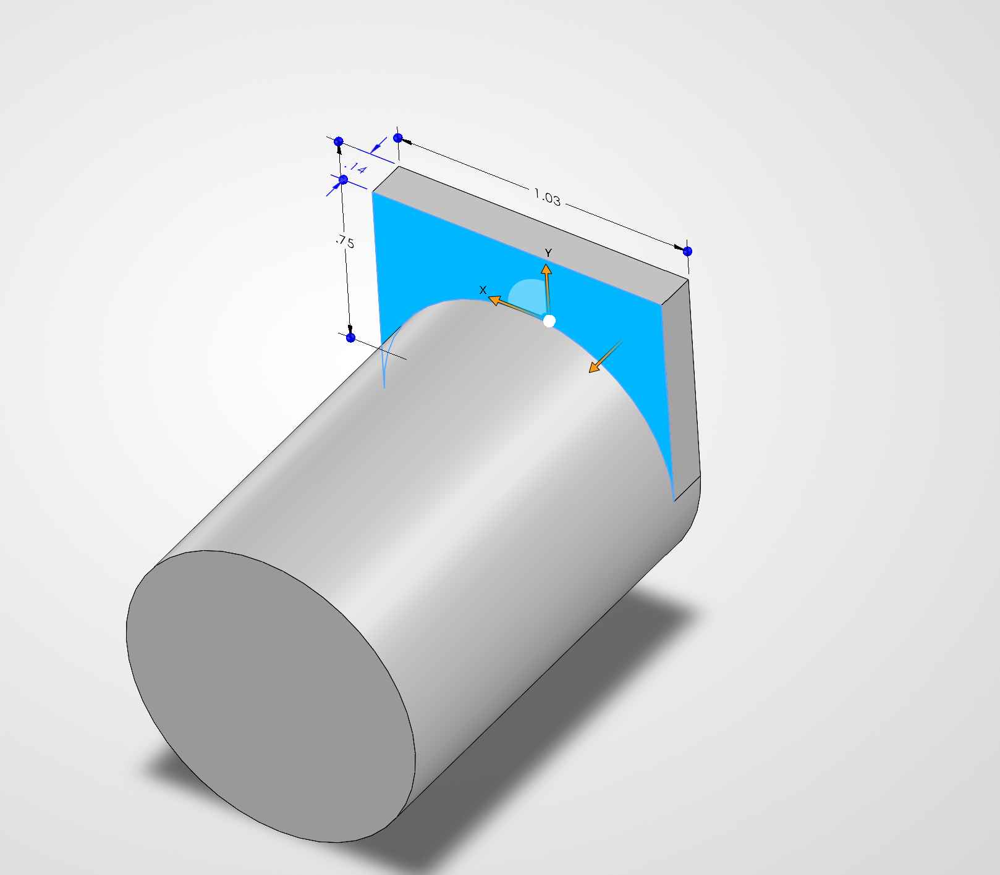

### Feature C

Feature C forms the main horizontal portion of the bracket and provides the supporting surface for the upper features.

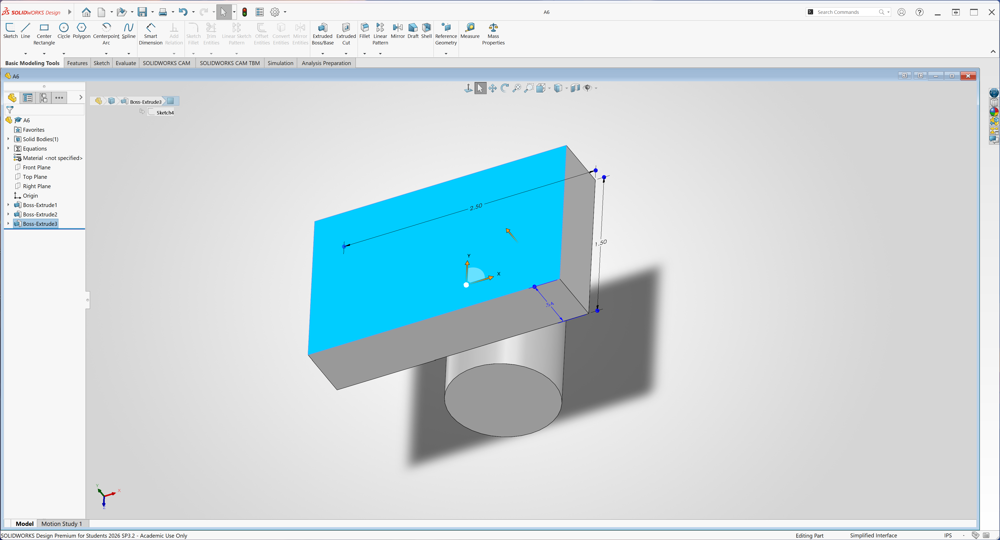

### Feature D

Feature D forms the side walls of the bracket.

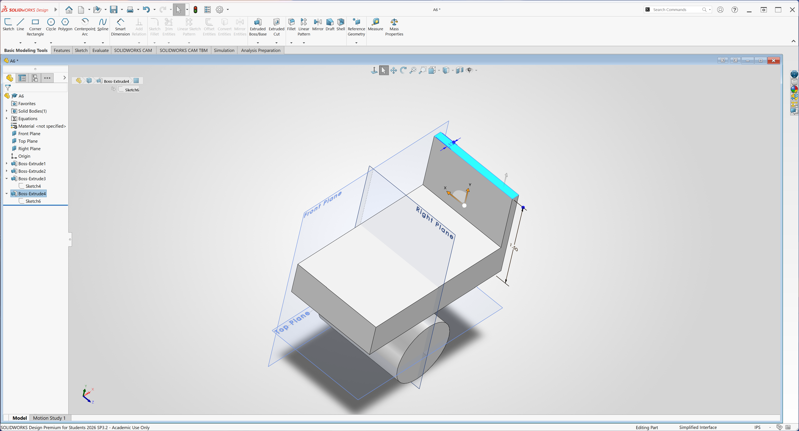

The opposite side was created using the SolidWorks mirror tool to maintain symmetry.

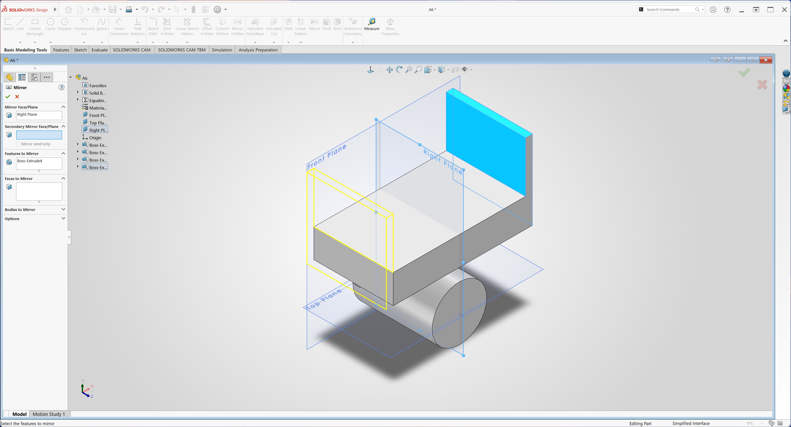

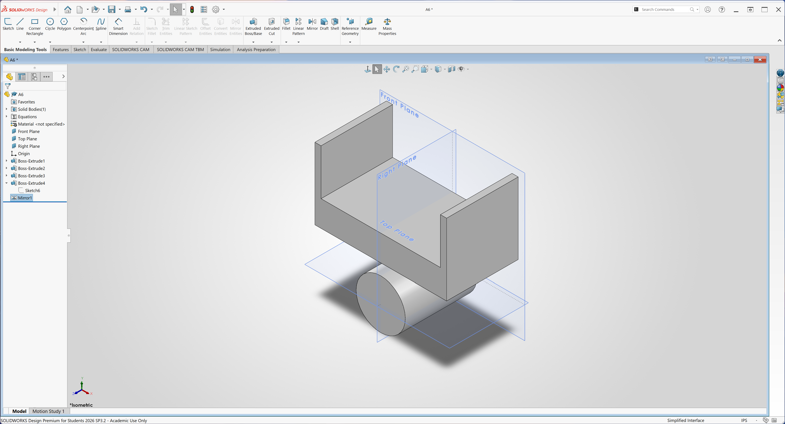

### Feature E

Feature E forms the upper portions of the bracket that retain the T-beam.

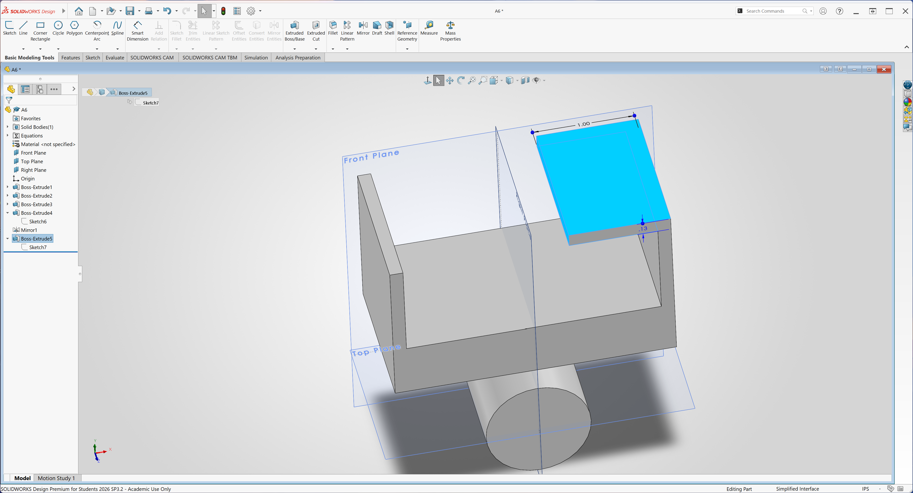

The second Feature E was created by mirroring the first feature.

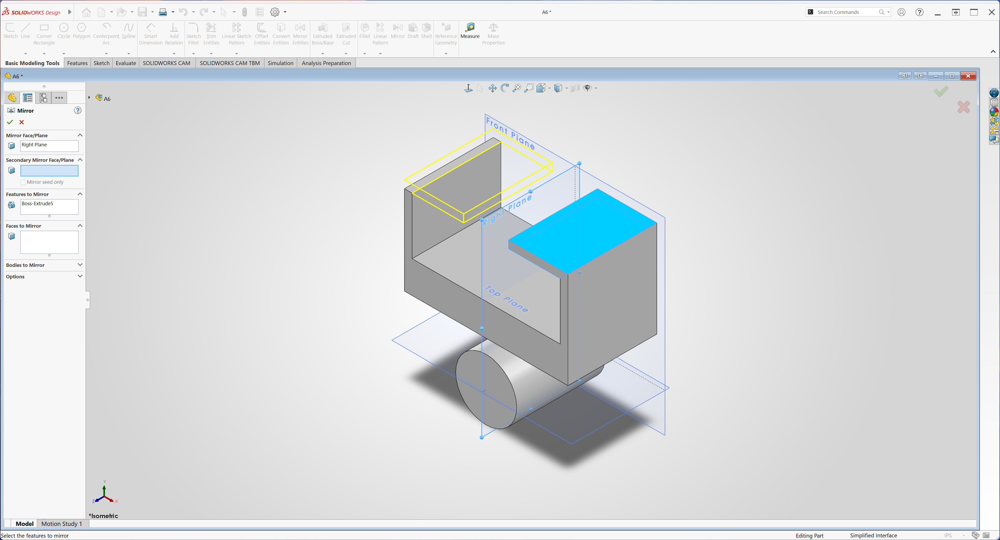

### Completed Bracket

The completed parametric bracket incorporates Features A through E and the revised T-beam interface.

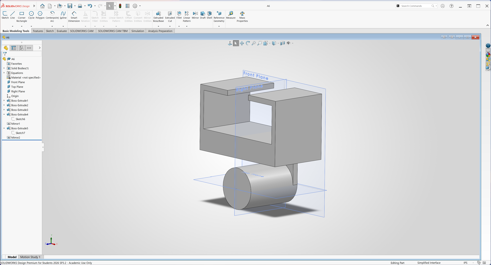

---

## Communicate

A multiview engineering drawing was created using third-angle projection. The drawing includes the major dimensions required to manufacture the bracket and identifies the important dimensions associated with the T-beam interface.

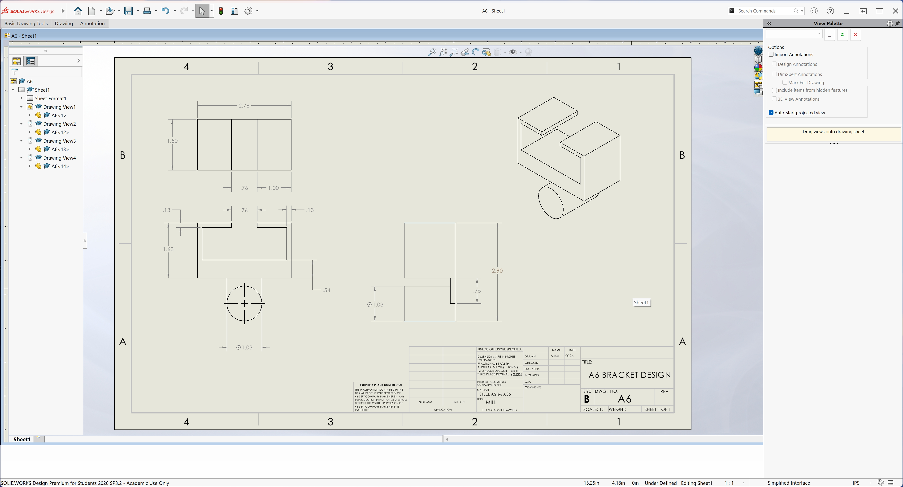

### CAD Files

[Download Bracket CAD Model](files/A6.SLDPRT)

---

## Reflection

One of the most useful parts of this assignment was connecting the engineering analysis directly to the CAD model. Feature A's diameter was controlled by the strength equation entered into the SolidWorks equation table. Because the dimension was equation-driven, changing one of the design inputs would automatically change the resulting Feature A diameter rather than requiring the dimension to be recalculated and manually entered.

The T-beam interface requires tighter dimensional control because those surfaces must fit and slide together correctly. Dimensions that do not control the fit can use the general drawing tolerances because small dimensional variations have much less effect on the function of the bracket. Applying unnecessarily tight tolerances to noncritical dimensions would increase manufacturing difficulty and cost without improving the function of the part.

One lesson I learned from this assignment was how useful parametric modeling can be when an engineering design changes. Instead of treating the CAD model and calculations as separate tasks, equations and global variables allow the model to respond directly to changes in design requirements.

**Actual Time:** Approximately 4.5 hours

---

# MEGR 2157 – Link

## Parametric Link Design

For the MEGR 2157 portion of the assignment, a link was created to interface with Feature A of the bracket and a 1-inch shaft. The link dimensions were defined parametrically so that the important mating dimensions were clearly controlled.

The upper hole corresponds to the diameter of bracket Feature A, while the lower hole provides the interface with the shaft.

### Link Sketch

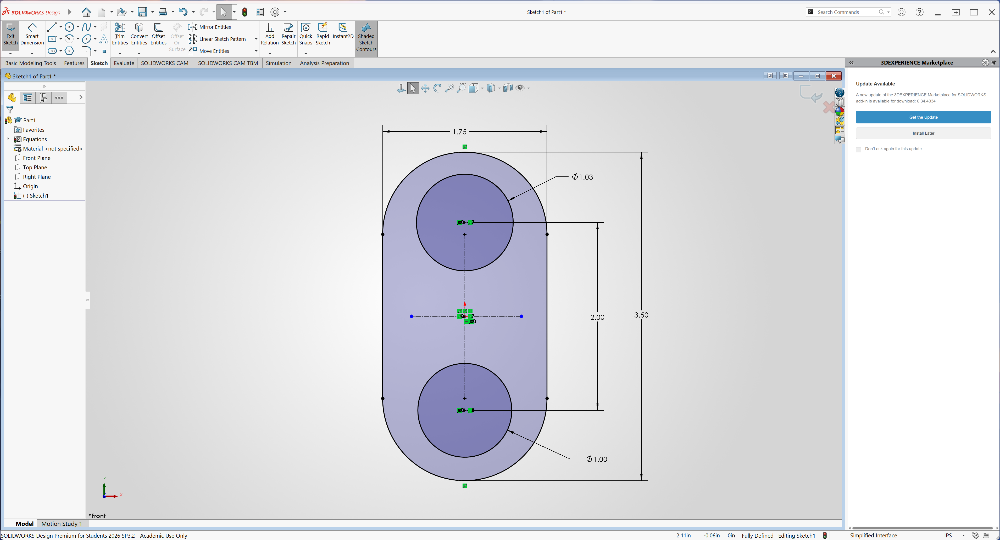

### Completed Link

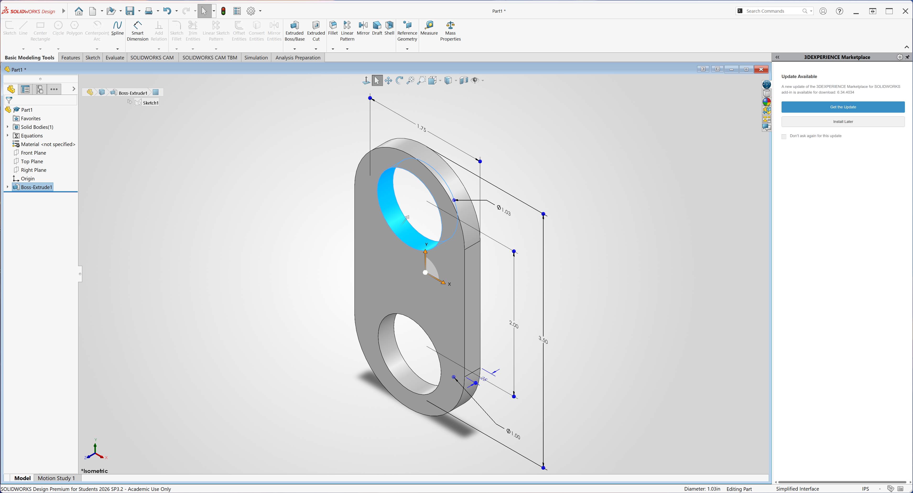

## Link Engineering Drawing

A multiview engineering drawing was created for the link. The two mating holes were given tighter tolerances than the noncritical overall dimensions because they directly control part-to-part compatibility.

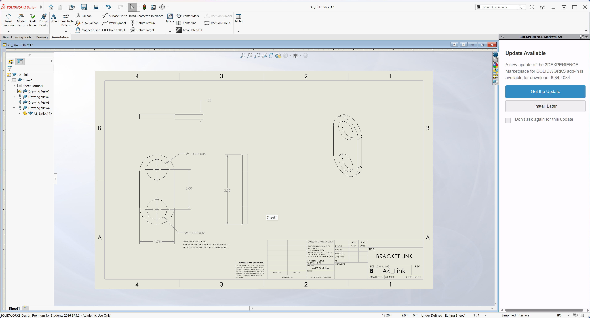

### Link CAD File

[Download Link CAD Model](files/A6_Link.SLDPRT)

## MEGR 2157 Reflection

The link demonstrates how tolerancing is used to maintain compatibility between separate components. The upper hole must properly interface with Feature A of the bracket, while the lower hole must interface with the shaft. These dimensions therefore require closer control than dimensions that only define the overall shape of the link.

Engineering tolerances also communicate design intent to manufacturing by showing which dimensions are critical to the function of the assembly and which dimensions can accept greater variation.